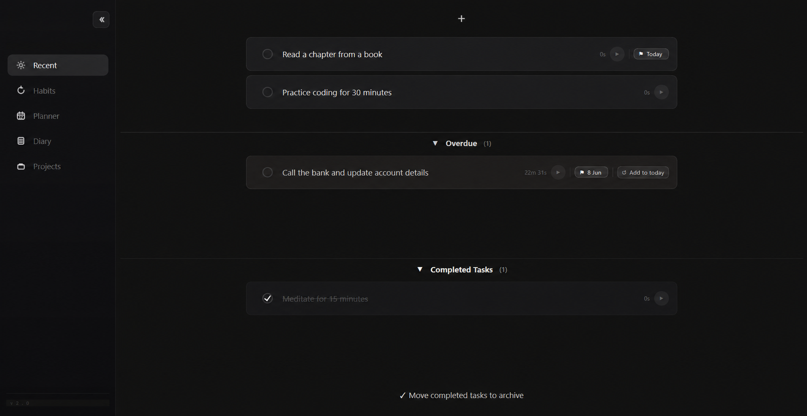
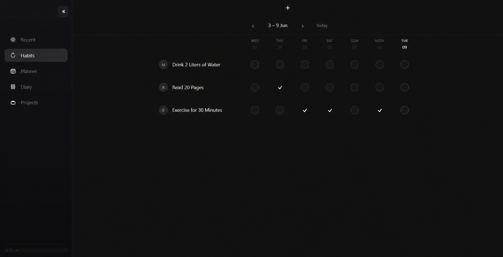
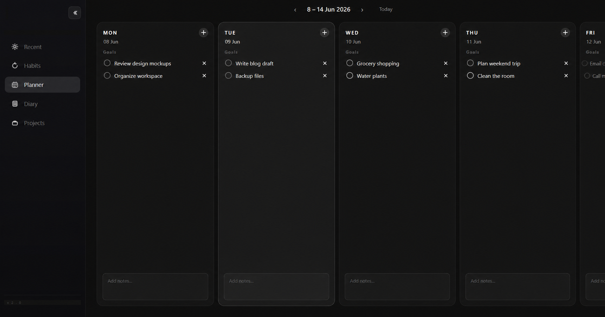
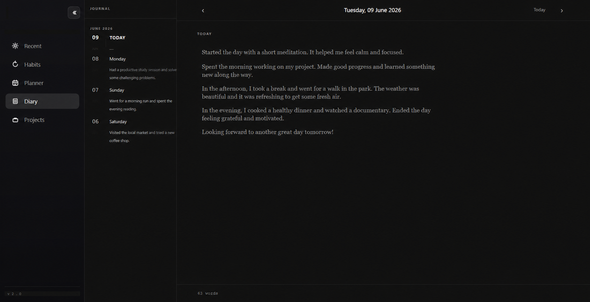

# TrackerX

TrackerX is a local-first, privacy-focused desktop productivity suite built with Python and PySide6. It provides a comprehensive set of tools to help you manage your daily tasks, habits, projects, and personal journal, all in one sleek, modern desktop application.

## 📸 Screenshots

<p align="center">
  
  
  
  
</p>

## 🌟 Features

- **Habit Tracking**: Build and maintain positive habits with an intuitive tracker.
- **Task Planner**: Organize your daily schedule and to-do lists effectively.
- **Project Management**: Break down large goals into manageable projects and tasks.
- **Personal Diary**: Keep a secure, local journal for your daily thoughts and reflections.
- **Local-First & Private**: All your data is securely stored locally on your machine. No cloud syncs, no privacy concerns.

## 🛠️ Technology Stack

- **Language**: [Python 3.10+](https://www.python.org/)
- **GUI Framework**: [PySide6](https://doc.qt.io/qtforpython-6/) (Qt for Python)
- **Packaging**: [PyInstaller](https://pyinstaller.org/)

## 🚀 Installation & Setup

1. **Clone the repository:**
   ```bash
   git clone https://github.com/Jit-Roy/TrackerX.git
   cd TrackerX
   ```

2. **Create a virtual environment (Optional but recommended):**
   ```bash
   python -m venv .venv
   # On Windows:
   .venv\Scripts\activate
   # On macOS/Linux:
   source .venv/bin/activate
   ```

3. **Install the package and dependencies:**
   ```bash
   pip install -r requirements.txt
   # Or install it locally as a module:
   pip install -e .
   ```

## 🎮 Usage

To launch the TrackerX application, run:
```bash
python trackerx/main.py
```
*Alternatively, if installed as a package, you can just run `trackerx` in your terminal.*

## 📦 Building the Executable

To bundle the application into a standalone executable (using `TrackerX.spec`), run:
```bash
pip install pyinstaller
pyinstaller TrackerX.spec
```
The compiled executable will be generated inside the `dist/` directory.

## 🤝 Contributing

Contributions, issues, and feature requests are welcome! Feel free to check the [issues page](https://github.com/Jit-Roy/TrackerX/issues).